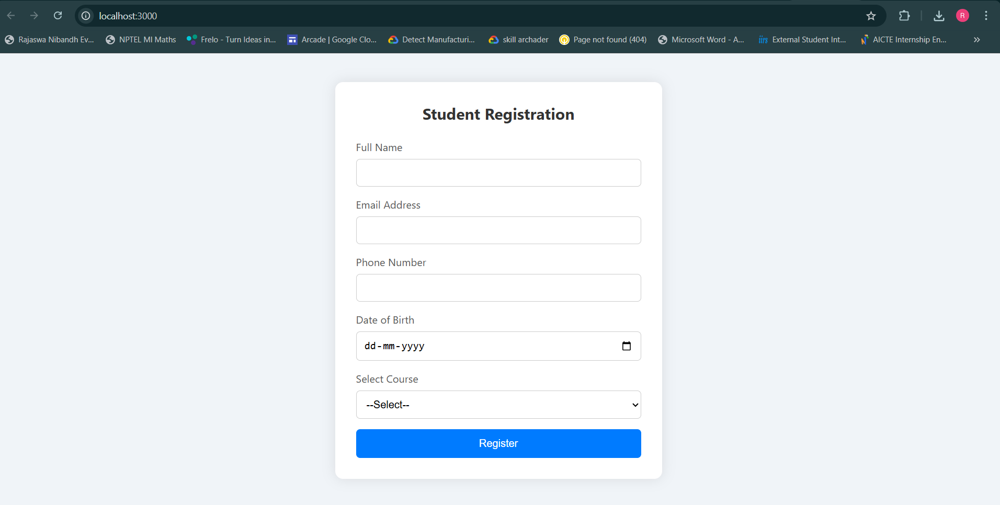

# Student Registration Form

A modern and responsive student registration web application built with **HTML, CSS, and JavaScript** on the frontend and **Node.js with MySQL** on the backend. This project replaces manual form registration with a digital workflow, improving accuracy and reducing workload by 80%.

---

##  Features

- Responsive UI for desktop, tablet, and mobile
- Digital form submission with real-time validations
- Stores student data in MySQL securely
- Checks for duplicate email registration
- View all registered students in MySQL Workbench

---

## Tech Stack

| Frontend        | Backend        | Database  |
|----------------|----------------|-----------|
| HTML, CSS, JS   | Node.js (Express) | MySQL     |

---


## Setup Instructions

1. Clone the repository:

```bash
git clone https://github.com/rohit-447/GUVI-Project-1.git
```

2. Import `studentdb.sql` in your MySQL Workbench to create the database and table.
```sql
CREATE DATABASE studentdb;
USE studentDB;

CREATE TABLE students (
  id INT AUTO_INCREMENT PRIMARY KEY,
  name VARCHAR(100),
  email VARCHAR(100) UNIQUE,
  phone VARCHAR(15),
  dob DATE,
  course VARCHAR(50)
);
```

3. Run a local server using node and open `index.html`.

4. Make sure `server.js` contains your MySQL credentials.

## Screenshots



## Author

Rohit Kumar  
B.Sc. Computer Science and Data Analytics  
Indian Institute of Technology, Patna

## License

This project is licensed under the MIT License.
